# Arquitectura Atómica de Colecciones y Plan de Migración VTEX ➔ Shopify
**Cliente:** Arturo Calle (`arturocalle.com`)  
**Preparado por:** Grovi Studio  
**Fecha:** Octubre 2026  
**Matriz de Datos para Excel:** [`Estructura_Colecciones_Shopify_Arturo_Calle.csv`](file:///Users/cesarandresjimenezarci/Documents/Clientes/Arturo%20Calle/Estructura_Colecciones_Shopify_Arturo_Calle.csv) *(88 Colecciones Atómicas)*

---

## 1. Principio Fundamental: Separación de Intenciones de Búsqueda (Atomic Collections)

Un error común en migraciones de eCommerce es agrupar dos productos distintos en una misma URL (por ejemplo, *Bermudas y Shorts* o *Buzos y Suéteres*). En Google y en la mente del comprador, **responden a intenciones, ocasiones de uso y búsquedas completamente diferentes**:

| Fusión Errónea (Evitada) | Desglose Atómico Recomendado | Justificación SEO y de Negocio |
| :--- | :--- | :--- |
| **Bermudas y Shorts** | 1. `/collections/bermudas-hombre` 2. `/collections/shorts-hombre` | *Bermuda* es de dril/casual para vestir de día (24.8K búsquedas). *Short* es deportivo, descanso o pantaloneta de baño (32.5K búsquedas). |
| **Buzos y Suéteres** | 1. `/collections/buzos-hoodies-hombre` 2. `/collections/sueteres-sacos-punto-hombre` 3. `/collections/cardigans-hombre` | *Buzo/Hoodie* es urbano de algodón con capota (34.4K búsquedas). *Suéter/Saco* es tejido de punto formal/ejecutivo (23.2K búsquedas). |
| **Chaquetas y Abrigos** | 1. `/collections/chaquetas-hombre` 2. `/collections/chaquetas-cuero-hombre` 3. `/collections/chaquetas-acolchadas-puffer-hombre` 4. `/collections/abrigos-gabanes-hombre` | *Chaqueta casual* es ligera. *Cuero* es ticket alto ($500k+). *Puffer* es térmica. *Abrigo/Gabán* es paño largo para frío extremo/viaje. |
| **Cinturones y Reatas** | 1. `/collections/cinturones-cuero-hombre` 2. `/collections/reatas-correas-lona-hombre` | *Cinturón* es formal/cuero con hebilla. *Reata* es lona/elástica para bermuda o look sport. |
| **Billeteras y Tarjeteros** | 1. `/collections/billeteras-cuero-hombre` 2. `/collections/tarjeteros-cuero-hombre` | *Billetera* es tradicional de 2-3 cuerpos. *Tarjetero* es ultra-delgado para tarjetas y billetes doblados. |
| **Maletas y Morrales** | 1. `/collections/maletas-viaje-equipaje` 2. `/collections/morrales-mochilas-ejecutivas-hombre` 3. `/collections/maletines-portafolios-trabajo` | *Maleta* es equipaje de viaje con ruedas (29.1K búsquedas). *Morral* es espalda para diario. *Maletín* es portafolio de mano para laptop. |
| **Eventos: Matrimonio y Grados** | 1. `/collections/trajes-matrimonio-novios` 2. `/collections/trajes-grados-prom` | Público y tono distintos: Novio/Padrinos de boda ($1M+ traje formal o lino) vs Jóvenes graduandos y prom escolar. |
| **Tipos de Camisas** | 1. `/collections/camisas-formales-manga-larga-hombre` 2. `/collections/camisas-casuales-hombre` 3. `/collections/camisas-lino-hombre` 4. `/collections/camisas-guayaberas-hombre` 5. `/collections/camisas-cuello-neru-mao-hombre` 6. `/collections/camisas-manga-corta-hombre` 7. `/collections/camisas-oxford-hombre` | Cada tipología de camisa responde a una búsqueda exacta con alta conversión en Google. |

---

## 2. Árbol de Jerarquía Completo (88 Colecciones Maestras)

```mermaid
graph TD
    AC[Arturo Calle Home] --> H[Hombre]
    AC --> M[Mujer]
    AC --> K[Kids / Niños]
    AC --> C[Colore]
    AC --> F[Freedom]
    AC --> S[Especiales / Ocasión]

    %% Hombre
    H --> HF[Sastrería & Formal]
    H --> HC[Camisería]
    H --> HP[Pantalones & Denim]
    H --> HA[Ropa de Abrigo]
    H --> HT[Polos & Camisetas]
    H --> HZ[Calzado Masculino]
    H --> HM[Marroquinería & Cuero]
    H --> HI[Ropa Interior & Cuidado]

    HF --> HF1[Trajes Completos]
    HF --> HF2[Blazers Hombre]
    HF --> HF3[Smokings y Gala]
    HF --> HF4[Chalecos de Traje]

    HC --> HC1[Camisas Formales M/L]
    HC --> HC2[Camisas Casuales]
    HC --> HC3[Camisas de Lino]
    HC --> HC4[Guayaberas]
    HC --> HC5[Cuello Nerú / Mao]
    HC --> HC6[Manga Corta]
    HC --> HC7[Camisas Oxford]

    HP --> HP1[Pantalones Dril / Chinos]
    HP --> HP2[Pantalones de Vestir]
    HP --> HP3[Pantalones Cargo]
    HP --> HP4[Joggers]
    HP --> HP5[Jeans Slim Fit]
    HP --> HP6[Jeans Clásicos / Straight]
    HP --> HP7[Bermudas en Dril]
    HP --> HP8[Shorts y Pantalonetas]

    HA --> HA1[Buzos y Hoodies]
    HA --> HA2[Suéteres y Sacos de Punto]
    HA --> HA3[Cárdigans]
    HA --> HA4[Chaquetas Bomber/Casuales]
    HA --> HA5[Chaquetas 100% Cuero]
    HA --> HA6[Chaquetas Puffer Acolchadas]
    HA --> HA7[Abrigos y Gabanes Paño]
    HA --> HA8[Chalecos Acolchados]

    HZ --> HZ1[Mocasines en Cuero]
    HZ --> HZ2[Zapatos Formales Oxford/Derby]
    HZ --> HZ3[Tenis y Sneakers Cuero]
    HZ --> HZ4[Botas y Botines Cuero]
    HZ --> HZ5[Sandalias y Descanso]

    HM --> HM1[Cinturones de Cuero]
    HM --> HM2[Reatas de Lona]
    HM --> HM3[Billeteras de Cuero]
    HM --> HM4[Tarjeteros Minimalistas]
    HM --> HM5[Maletas de Viaje]
    HM --> HM6[Morrales Ejecutivos]
    HM --> HM7[Maletines Portafolio]
    HM --> HM8[Neceseres de Viaje]
    HM --> HM9[Corbatas de Seda]
    HM --> HM10[Corbatines / Pajaritas]
    HM --> HM11[Pañuelos de Bolsillo]
    HM --> HM12[Mancornas / Gemelos]

    %% Especiales
    S --> S1[Trajes para Matrimonio y Novios]
    S --> S2[Trajes para Grados y Prom]
    S --> S3[Colección Lino Premium]
    S --> S4[Lookbook Oficina y Trabajo]
    S --> S5[Regalos para Hombres]
    S --> S6[Ofertas y Descuentos Sale]
```

---

## 3. Resumen de la Matriz Excel (`Estructura_Colecciones_Shopify_Arturo_Calle.csv`)

El archivo CSV cuenta con **12 columnas estandarizadas** para importación y gestión:
1. `Nivel_Jerarquia`: L1 (Departamento/Línea), L2 (Categoría Principal), L3 (Subcategoría Atómica), L4 (Ocasión/Especial).
2. `Departamento_Linea`: Hombre, Mujer, Kids, Colore, Freedom, Especiales.
3. `Nombre_Coleccion`: Nombre visible en frontend y navegación.
4. `Shopify_URL_Handle`: Handle limpio bajo `/collections/[handle]`.
5. `VTEX_URL_Origen_Estimada`: URL previa en VTEX para crear la regla de **Redirección 301**.
6. `Tipo_Coleccion_Shopify`: Automated (Smart Collection) vs Manual.
7. `Regla_Condiciones_Shopify`: Filtros automáticos exactos (`product_type`, `tag`, `brand`, `compare_at_price`).
8. `Palabras_Clave_Objetivo`: Keywords con intención real de compra en Colombia.
9. `Volumen_Busqueda_Mes_CO`: Búsquedas mensuales consolidadas en Colombia.
10. `Title_Tag_Recomendado_SEO`: Etiqueta de título optimizada (CTR + Keyword).
11. `H1_Recomendado`: Encabezado principal de la colección.
12. `Prioridad_Migracion`: P1 (Crítica para lanzamiento), P2 (Secundaria / Complementaria), P3.

---

## 4. Buenas Prácticas Técnicas en Shopify para esta Estructura

1. **Colecciones Automatizadas por Tags y Tipo de Producto:**
   * Al tener reglas atómicas (ej: `product_type == Camisas` Y `tag == lino`), el catálogo de Shopify se auto-organiza en tiempo real cuando el equipo de compras sube nuevos productos.
2. **Navegación Multinivel con Shopify Search & Discovery:**
   * La estructura de menús anidada permite que el usuario navegue `Hombre > Ropa > Camisas > Lino`, mientras que la URL permanece limpia y directa: `arturocalle.com/collections/camisas-lino-hombre`.
3. **Mapeo de Redirecciones 301 sin Pérdida de Tráfico:**
   * Al mapear tanto las URLs antiguas de categorías (`/hombre/ropa/camisas`) como las landings sueltas (`/t/camisa-rayada-hombre`), se transfiere el 100% de la autoridad acumulada hacia las nuevas colecciones de Shopify.
