# Arquitectura de Colecciones y Plan de Migración VTEX ➔ Shopify
**Cliente:** Arturo Calle (`arturocalle.com`)  
**Preparado por:** Grovi Studio  
**Fecha:** Octubre 2026  
**Archivo de datos complementario:** [`Estructura_Colecciones_Shopify_Arturo_Calle.csv`](file:///Users/cesarandresjimenezarci/Documents/Clientes/Arturo%20Calle/Estructura_Colecciones_Shopify_Arturo_Calle.csv)

---

## 1. Diagnóstico del Cambio de Paradigma: VTEX vs Shopify

| Característica | VTEX (Actual) | Shopify (Objetivo) | Recomendación SEO Grovi |
| :--- | :--- | :--- | :--- |
| **Estructura de URLs** | Anidada rígida (`/departamento/categoria/subcategoria`) | Plana (`/collections/[collection-handle]`) | Usar slugs limpios y directos (ej: `/collections/camisas-hombre`). |
| **Páginas de Producto (PDP)** | Formato con ID/SKU (`/nombre-producto-sku-123/p`) | Formato plano (`/products/[product-handle]`) | Mapear redirecciones 301 de todos los SKUs activos hacia su nueva URL Shopify. |
| **Jerarquía y Árbol** | Basada en carpetas del CMS | Basada en Menú de Navegación, Breadcrumbs y Filtros | Construir la jerarquía visual con **Shopify Search & Discovery** y Schema `BreadcrumbList`. |
| **Filtros / Facetas** | Generan URLs indexables (`?map=c,c`) | Parámetros dinámicos en frontend | Mantener canonical hacia la colección base para evitar contenido duplicado. |
| **Colecciones Temporales** | Landings sueltas (`/t/traje-hombre`, `/addi-...`) | **Smart Collections** automáticas por tags | Integrar las landings `/t/` dentro de `/collections/` oficiales para consolidar autoridad. |

---

## 2. Árbol Maestro de Colecciones Shopify

```mermaid
graph TD
    AC[Arturo Calle Home] --> H[Hombre]
    AC --> M[Mujer]
    AC --> K[Kids / Niños]
    AC --> C[Colore]
    AC --> F[Freedom]
    AC --> S[Especiales / Ocasión]

    %% Hombre
    H --> HR[Ropa Hombre]
    H --> HF[Sastrería & Formal]
    H --> HC[Calzado Hombre]
    H --> HA[Accesorios & Cuero]

    HR --> HRC[Camisas: Formales, Casuales, Lino, Rayas]
    HR --> HRP[Pantalones: Dril, Cargo, Vestir]
    HR --> HRJ[Jeans Hombre]
    HR --> HRT[Polos y Camisetas]
    HR --> HRB[Buzos y Sweaters]
    HR --> HRA[Chaquetas y Abrigos]

    HF --> HFT[Trajes Completos]
    HF --> HFB[Blazers Hombre]
    HF --> HFS[Smokings y Gala]

    HC --> HCM[Mocasines en Cuero]
    HC --> HCZ[Zapatos Formales / Oxford]
    HC --> HCT[Tenis y Sneakers Casuales]

    HA --> HAM[Maletas y Morrales de Viaje]
    HA --> HAC[Cinturones y Billeteras]
    HA --> HAK[Corbatas y Corbatines]

    %% Mujer
    M --> MV[Vestidos Elegantes y Casuales]
    M --> MB[Blazers Mujer]
    M --> ML[Blusas y Camisas]
    M --> MP[Pantalones y Jeans]

    %% Especiales
    S --> SE1[Trajes para Matrimonios y Grados]
    S --> SE2[Guía de Regalos para Hombre]
    S --> SE3[Colección Lino Premium]
    S --> SE4[Ofertas Oficiales / Sale]
```

---

## 3. Matriz Resumen de Colecciones Principales (Extracto del CSV)

| Nivel | Departamento | Colección | Shopify Handle | VTEX URL Origen | Búsquedas / Mes | Prioridad |
| :---: | :--- | :--- | :--- | :--- | :---: | :---: |
| **L1** | Hombre | Sastrería y Formal | `/collections/sastreria-formal-hombre` | `/hombre/sastreria` | 12.100 | **P1** |
| **L2** | Hombre | Trajes Completos | `/collections/trajes-hombre` | `/t/traje-para-hombre` | 18.100 | **P1** |
| **L2** | Hombre | Blazers Hombre | `/collections/blazers-hombre` | `/hombre/ropa/blazers` | 22.200 | **P1** |
| **L2** | Hombre | Smokings y Gala | `/collections/smokings-gala-hombre` | `/hombre/ropa/smokings` | 20.100 | **P1** |
| **L2** | Hombre | Camisas Hombre | `/collections/camisas-hombre` | `/hombre/ropa/camisas` | 24.200 | **P1** |
| **L3** | Hombre | Camisas de Lino | `/collections/camisas-lino-hombre` | `/t/camisas-lino-hombre` | 5.400 | **P1** |
| **L3** | Hombre | Pantalones Cargo | `/collections/pantalones-cargo-hombre` | `/t/pantalon-cargo-hombre` | 27.100 | **P1** |
| **L2** | Hombre | Mocasines Hombre | `/collections/mocasines-hombre` | `/hombre/calzado/mocasines` | 18.700 | **P1** |
| **L2** | Hombre | Maletas y Morrales | `/collections/maletas-morrales-viaje` | `/hombre/accesorios/maletas` | 29.100 | **P1** |
| **L2** | Mujer | Vestidos Mujer | `/collections/vestidos-mujer` | `/mujer/ropa/vestidos` | 49.500 | **P1** |
| **L2** | Mujer | Blazers Mujer | `/collections/blazers-mujer` | `/mujer/ropa/blazers` | 14.800 | **P1** |
| **L4** | Especiales | Matrimonios y Grados | `/collections/trajes-matrimonio-grados` | `/t/trajes-eventos` | 14.800 | **P1** |
| **L4** | Especiales | Regalos para Hombres | `/collections/regalos-para-hombres` | `/t/regalos-hombres` | 10.400 | **P1** |
| **L4** | Especiales | Ofertas y Descuentos | `/collections/ofertas-descuentos` | `/ac-ofertas` | 14.800 | **P1** |

> 📁 *La matriz completa con las 49 colecciones, reglas de Shopify (Smart Conditions), Title Tags y H1 recomendados se encuentra en [`Estructura_Colecciones_Shopify_Arturo_Calle.csv`](file:///Users/cesarandresjimenezarci/Documents/Clientes/Arturo%20Calle/Estructura_Colecciones_Shopify_Arturo_Calle.csv).*

---

## 4. Reglas Críticas para la Migración SEO en Shopify

1. **Gestión de Redirecciones 301 Masivas:**
   * Cargar el archivo de redirecciones a través de `Shopify Admin ➔ Navigation ➔ URL Redirects` (o mediante la API / app como *Transportr / Easy Redirects*).
   * Prohibir redirecciones a la Home (`/`): cada categoría y producto antiguo debe redirigir a su equivalente exacto en Shopify.
2. **Canonical Tags de Producto Directos:**
   * Configurar en el tema de Shopify (Liquid) que los enlaces de productos apunten a `/products/[handle]` y no a `/collections/[collection]/products/[handle]` para no diluir el PageRank ni duplicar URLs.
3. **Optimización de Colecciones Inteligentes (Smart Collections):**
   * Configurar etiquetas (*tags*) y tipos de producto normalizados en el ERP/PIM antes de la carga a Shopify para que las colecciones se pueblen automáticamente sin errores de categorización.
4. **Marcado Schema.org Nativo:**
   * Implementar `CollectionPage`, `BreadcrumbList` y `Product` con oferta (`AggregateOffer` o `Offer`) para alimentar directamente a Google Search y motores de IA (ChatGPT Search, Perplexity).
